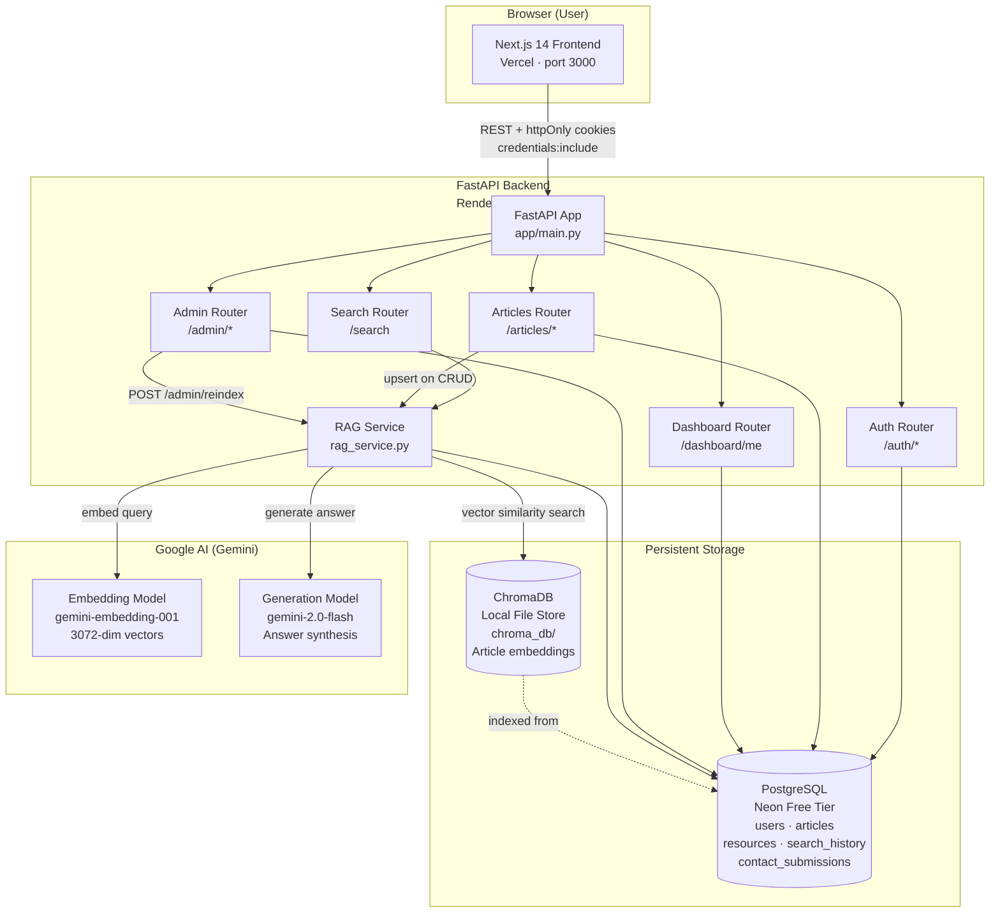
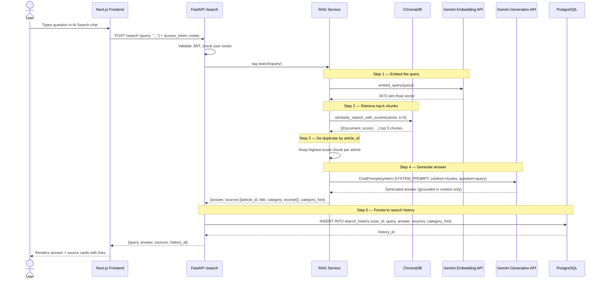
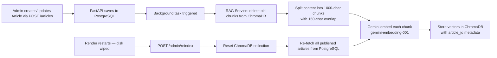
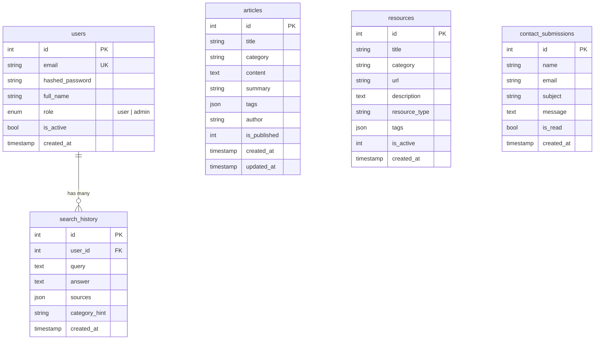

# Startup Navigator — Architecture

## System Architecture

```mermaid
graph TB
    subgraph Client["Browser (User)"]
        UI["Next.js 14 Frontend\nVercel · port 3000"]
    end

    subgraph Backend["FastAPI Backend\nRender · port 8000"]
        API["FastAPI App\napp/main.py"]
        AUTH["Auth Router\n/auth/*"]
        ARTICLES["Articles Router\n/articles/*"]
        SEARCH["Search Router\n/search"]
        DASHBOARD["Dashboard Router\n/dashboard/me"]
        ADMIN["Admin Router\n/admin/*"]
        RAG["RAG Service\nrag_service.py"]
    end

    subgraph Storage["Persistent Storage"]
        PG[("PostgreSQL\nNeon Free Tier\nusers · articles\nresources · search_history\ncontact_submissions")]
        CHROMA[("ChromaDB\nLocal File Store\nchroma_db/\nArticle embeddings")]
    end

    subgraph AI["Google AI (Gemini)"]
        EMB["Embedding Model\ngemini-embedding-001\n3072-dim vectors"]
        GEN["Generation Model\ngemini-2.0-flash\nAnswer synthesis"]
    end

    UI -->|"REST + httpOnly cookies\ncredentials:include"| API
    API --> AUTH
    API --> ARTICLES
    API --> SEARCH
    API --> DASHBOARD
    API --> ADMIN

    AUTH --> PG
    ARTICLES --> PG
    DASHBOARD --> PG
    ADMIN --> PG
    SEARCH --> RAG
    RAG --> PG

    RAG -->|"embed query"| EMB
    RAG -->|"vector similarity search"| CHROMA
    RAG -->|"generate answer"| GEN
    CHROMA -.->|"indexed from"| PG

    ARTICLES -->|"upsert on CRUD"| RAG
    ADMIN -->|"POST /admin/reindex"| RAG
```

---

## RAG Query Flow — Step by Step

```mermaid
sequenceDiagram
    actor User
    participant FE as Next.js Frontend
    participant API as FastAPI /search
    participant RAG as RAG Service
    participant CHROMA as ChromaDB
    participant GEMINI_EMB as Gemini Embedding API
    participant GEMINI_GEN as Gemini Generation API
    participant DB as PostgreSQL

    User->>FE: Types question in AI Search chat
    FE->>API: POST /search {query: "..."} + access_token cookie
    API->>API: Validate JWT, check user exists

    API->>RAG: rag.search(query)

    Note over RAG,GEMINI_EMB: Step 1 — Embed the query
    RAG->>GEMINI_EMB: embed_query(query)
    GEMINI_EMB-->>RAG: 3072-dim float vector

    Note over RAG,CHROMA: Step 2 — Retrieve top-k chunks
    RAG->>CHROMA: similarity_search_with_scores(vector, k=5)
    CHROMA-->>RAG: [(Document, score), ...] top 5 chunks

    Note over RAG: Step 3 — De-duplicate by article_id
    RAG->>RAG: Keep highest-score chunk per article

    Note over RAG,GEMINI_GEN: Step 4 — Generate answer
    RAG->>GEMINI_GEN: ChatPrompt(system=SYSTEM_PROMPT, context=chunks, question=query)
    GEMINI_GEN-->>RAG: Generated answer (grounded in context only)

    RAG-->>API: {answer, sources:[{article_id, title, category, excerpt}], category_hint}

    Note over API,DB: Step 5 — Persist to search history
    API->>DB: INSERT INTO search_history (user_id, query, answer, sources, category_hint)
    DB-->>API: history_id

    API-->>FE: {query, answer, sources, history_id}
    FE-->>User: Renders answer + source cards with links
```

---

## Indexing Flow (Article Create / Update / Reindex)

```mermaid
flowchart LR
    A[Admin creates/updates Article via POST /articles] --> B[FastAPI saves to PostgreSQL]
    B --> C[Background task triggered]
    C --> D[RAG Service: delete old chunks from ChromaDB]
    D --> E[Split content into 1000-char chunks\nwith 150-char overlap]
    E --> F[Gemini embed each chunk\ngemini-embedding-001]
    F --> G[Store vectors in ChromaDB\nwith article_id metadata]

    H[Render restarts — disk wiped] --> I[POST /admin/reindex]
    I --> J[Reset ChromaDB collection]
    J --> K[Re-fetch all published articles from PostgreSQL]
    K --> F
```

---

## Database Schema

```mermaid
erDiagram
    users {
        int id PK
        string email UK
        string hashed_password
        string full_name
        enum role "user | admin"
        bool is_active
        timestamp created_at
    }

    articles {
        int id PK
        string title
        string category
        text content
        string summary
        json tags
        string author
        int is_published
        timestamp created_at
        timestamp updated_at
    }

    resources {
        int id PK
        string title
        string category
        string url
        text description
        string resource_type
        json tags
        int is_active
        timestamp created_at
    }

    search_history {
        int id PK
        int user_id FK
        text query
        text answer
        json sources
        string category_hint
        timestamp created_at
    }

    contact_submissions {
        int id PK
        string name
        string email
        string subject
        text message
        bool is_read
        timestamp created_at
    }

    users ||--o{ search_history : "has many"
```
